# Herramientas propias del sistema

## Monitorización de procesos

### ps

Muestra los procesosen ejecución.

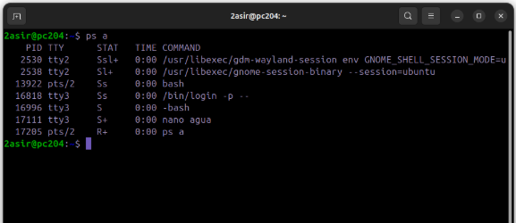

### ps aux

Muestra información más detallada.

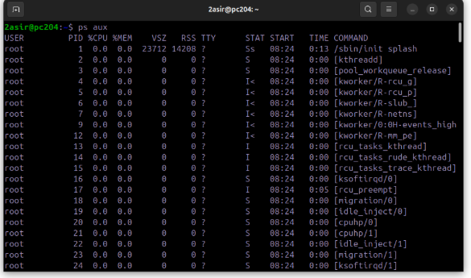

### ps -C nano

Busca un proceso, en este caso sería "nano". Para más información añadimos u.

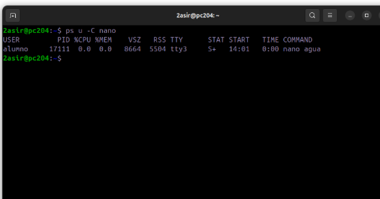

Para ver los 5 procesos que más CPU consumen usamos el comando **ps -eo pid,user,%cpu,%mem,etime,command --sort=-%cpu**

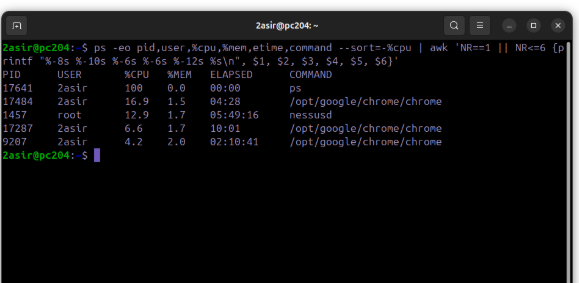

### top

Muestra una lista de procesos ordenados por consumo de recursos.

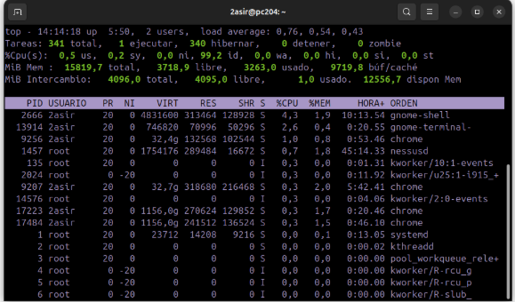

Con el comando **top -b -n 3 -o %CPU > top.txt** se ejecuta top, actualiza la lista de procesos 3 veces, ordena los procesos por el uso de CPU y guarda el resultado en el archivo top.txt.

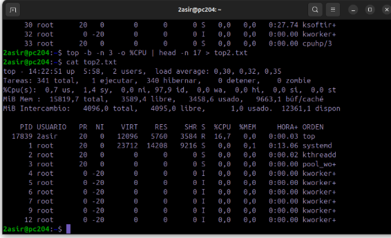

### atop

Muestra información detallada sobre el uso de recursos como CPU, memoria, disco, red y procesos individuales.

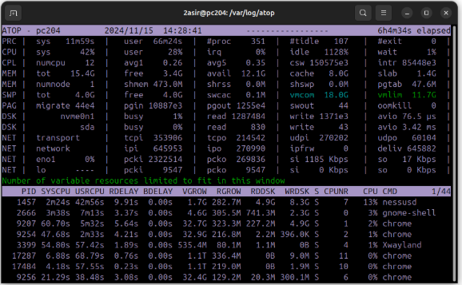

## Monitorización de la red

### tcpdump

Captura y analiza paquetes de red.

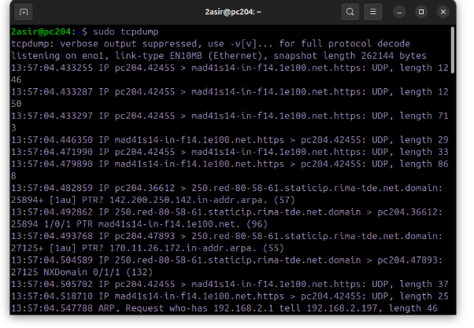

Usamos el comando **tcpdump -i eno1** para capturar los paquetes de nuestra red.

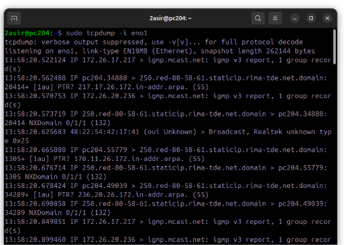

Para ver la salida de tcpdump lo redirigimos a un archivo con **tcpdump -i eno1 -w capturas**.

No podremos leer el contenido del archivo porque está encriptado.
Para que sea legible usamos **tcpdump -r capturas**.

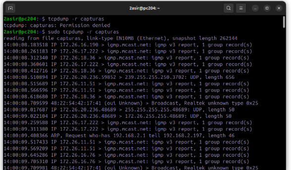

### tcptrack

Se utiliza para monitorear conexiones TCP en tiempo real. 

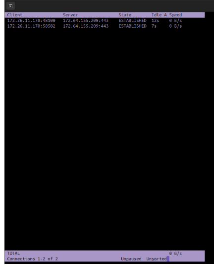

### iptraf

Se utiliza para la monitorización de red pero se centra en proporcionar una visión general de la actividad de red.

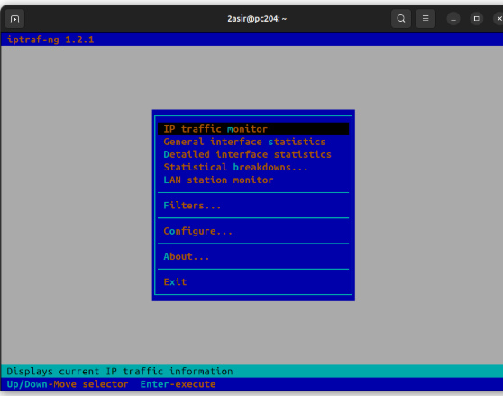

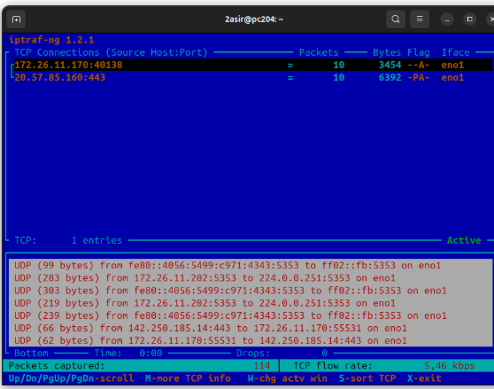

### bmon

Se utiliza para monitorear el uso de ancho de banda en tiempo real. 

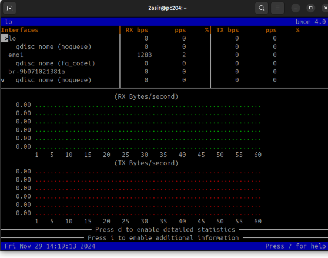

## Monitorización de almacenamiento

### free

Muestra la cantidad de memoria libre y utilizada que tiene el sistema.

Con **free -h**, la salida es mas legible y con **free -s** se puede ver en intervalos de 3 segundos.

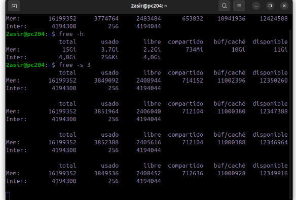

### df -h

Se utiliza para ver el espacio en disco tanto disponible como usado.

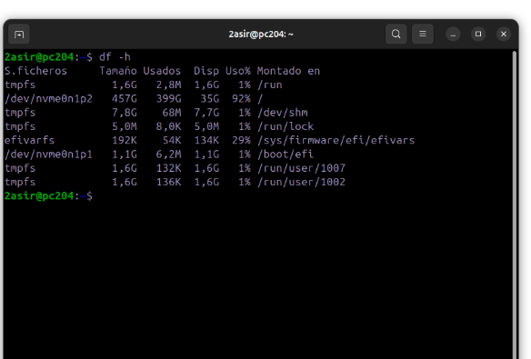

### du -sh 

Se utiliza para mostrar el espacio utilizado y disponible en el sistema de archivos, de una manera resumida y fácil de leer.

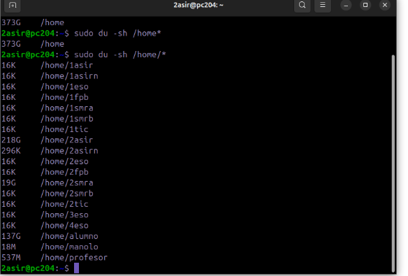

En este caso se especifica la ruta.

### iostat

Proporciona estadísticas de entrada/salida del sistema, relacionadas con el uso de dispositivos de almacenamiento y la carga del CPU.

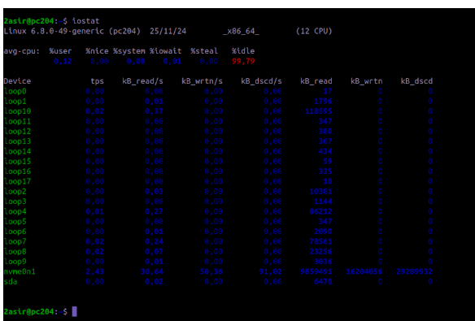

Con el comando **iostat -x nvm0n1** se mostra estadísticas detalladas de rendimiento del dispositivo de almacenamiento nvme0n1.

Con el comando **iostat -x nvm0n1 -s 5** se muestra lo mismo de antes pero en intervalos de 5 segundos.

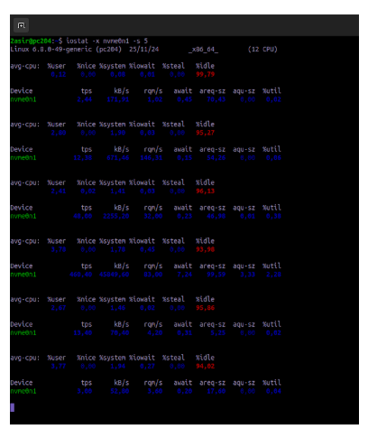
