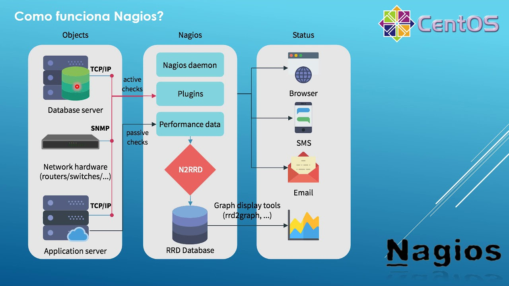
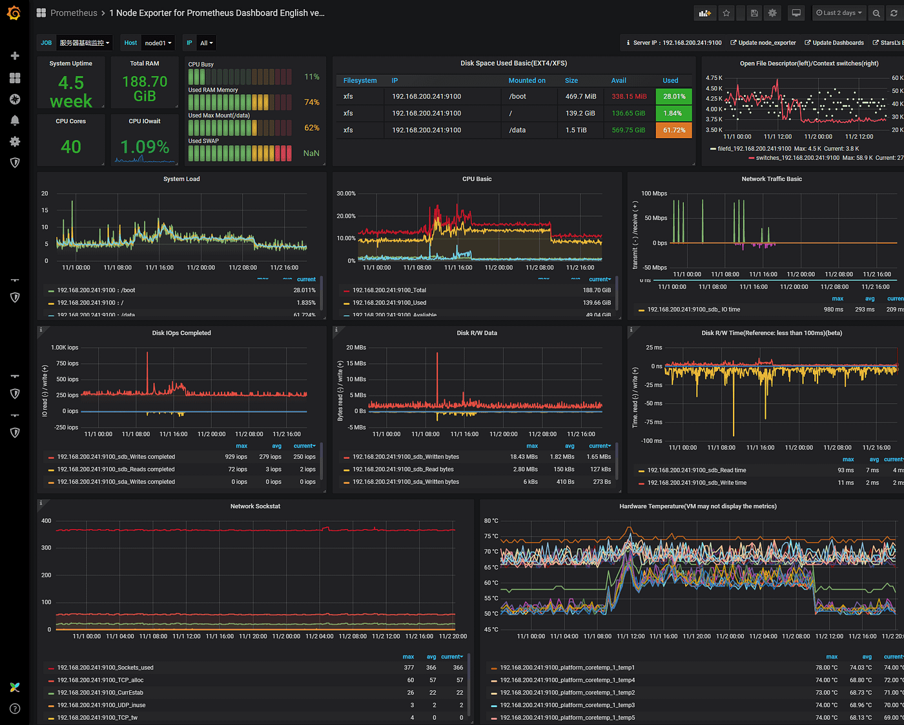
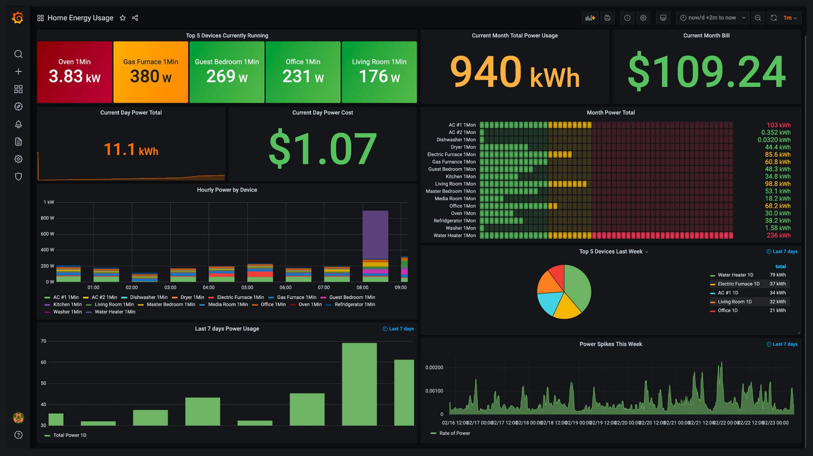
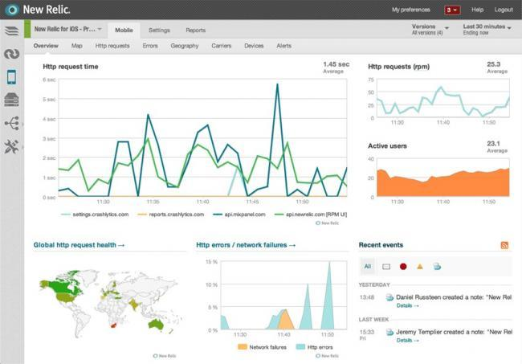

# Sistemas de monitorización

Los sistemas de monitorización son herramientas o plataformas diseñadas para supervisar el funcionamiento y el rendimiento de diversos componentes de infraestructura tecnológica. 
Su objetivo principal es garantizar el correcto funcionamiento de estos sistemas y detectar posibles problemas o fallos antes de que afecten a los usuarios o a las operaciones del negocio.

## Herramientas Comunes para Monitorización

Existen diversas herramientas de monitorización utilizadas en informática, entre ellas:

### Nagios 

* **Alertas automáticas:** Notificaciones en tiempo real ante problemas.
* **Escalabilidad:** Ampliable con plugins.
* **Interfaz básica:** Requiere configuración avanzada.

Herramienta de monitorización de red y servicios, ampliamente utilizada en entornos corporativos.

### Zabbix 

* **Interfaz gráfica:** Visualización intuitiva de datos.
* **Alertas personalizables:** Notificaciones basadas en eventos.
* **Escalable:** Adecuado para infraestructuras grandes.

Ofrece monitorización en tiempo real de redes, servidores, aplicaciones y bases de datos.

### Prometheus

* **Series temporales:** Recoge métricas históricas para análisis.
* **Integración con Grafana:** Visualización en tiempo real.
* **Escalable:** Ideal para microservicios y entornos distribuidos.

Especialmente diseñada para monitorizar contenedores y aplicaciones en entornos de microservicios.

### Grafana

* **Visualización de datos:** Crea dashboards interactivos.
* **Soporte para múltiples fuentes:** Se conecta con herramientas como Prometheus.
* **Alertas personalizables:** Configura alertas sobre las visualizaciones.
* **Escalable:** Funciona en entornos pequeños y grandes.

Usada en conjunto con Prometheus para la visualización de datos de monitorización en tiempo real.

### New Relic

* **Rendimiento en tiempo real:** Mide tiempos de respuesta y recursos.
* **Trazabilidad:** Detecta errores y cuellos de botella.
* **Escalable:** Adecuado para entornos en la nube.

Herramienta de monitorización de aplicaciones en la nube que proporciona información detallada sobre el rendimiento.
